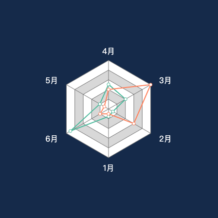
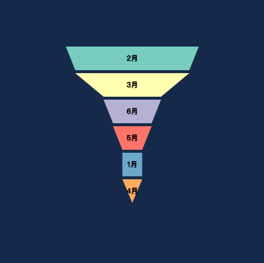
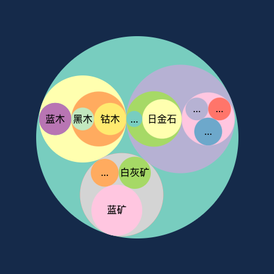
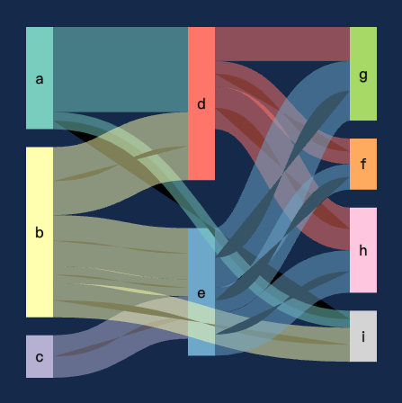
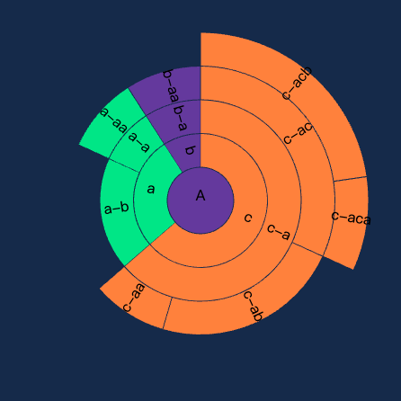
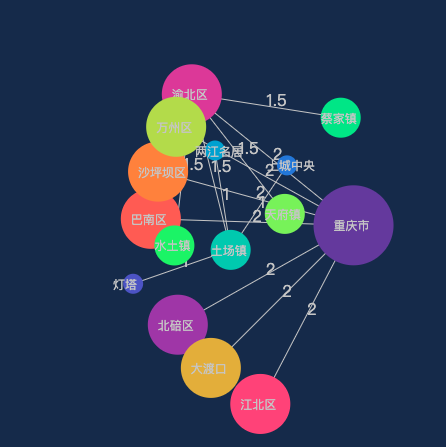
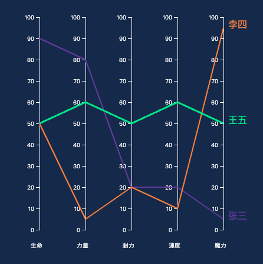
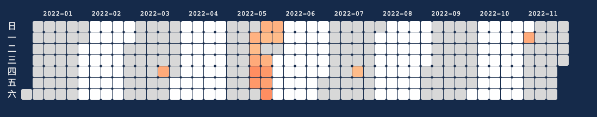
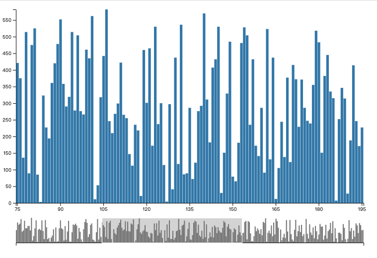
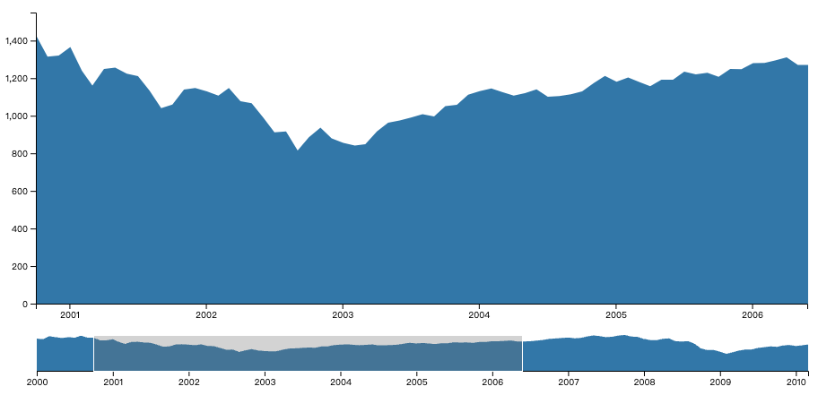

## D3-demo

[01.基础柱状图](./charts/01.基础柱状图.html)

[02.多列柱状图](./charts/02.多列柱状图.html)

[03.堆叠柱状图](./charts/03.堆叠柱状图.html)

[04.基础折线图](./charts/04.基础折线图.html)

[05.遮罩折线图](./charts/05.遮罩折线图.html)

[06.基础散点图](./charts/06.基础散点图.html)

[07.多标记散点图](./charts/07.多标记散点图.html)

[08.基础饼图](./charts/08.基础饼图.html)

[09.环状饼图](./charts/09.环状饼图.html)

[10.南丁格尔饼图](./charts/10.南丁格尔饼图.html)

[11.矩形树状图](./charts/11.矩形树状图.html)

[12.雷达图](./charts/12.雷达图.html)

[13.漏斗图](./charts/13.漏斗图.html)

[14.树图](./charts/14.树图.html)

[15.圆形填充图](./charts/15.圆形填充图.html)

[16.仪表盘](./charts/16.仪表盘.html)

[17.桑基图](./charts/17.桑基图.html)

[18.旭日图](./charts/18.旭日图.html)

[19.力导向图](./charts/19.力导向图.html)

[20.平行坐标系](./charts/20.平行坐标系.html)

[21.日历热力图](./charts/21.日历热力图.html)

[22.平移柱状图](./charts/22.平移柱状图.html)

[23.平移折线图](./charts/23.平移折线图.html)

