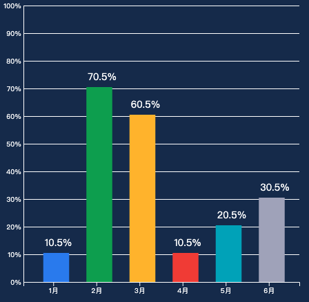
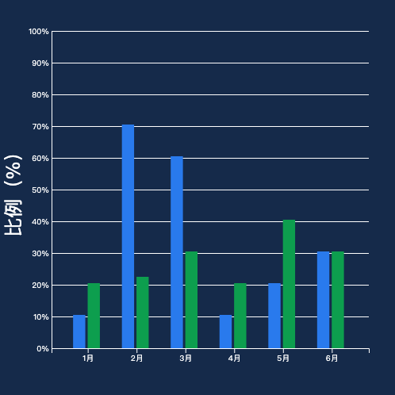
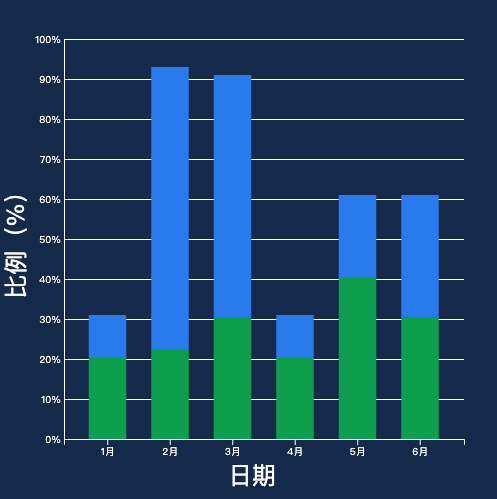
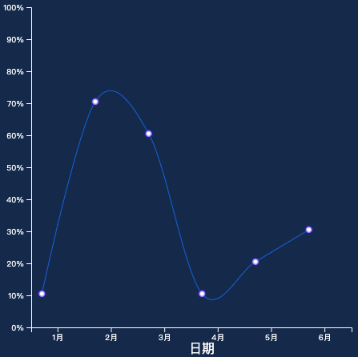
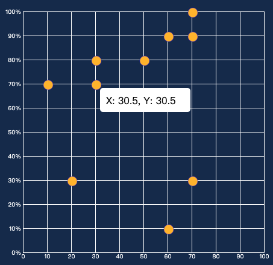
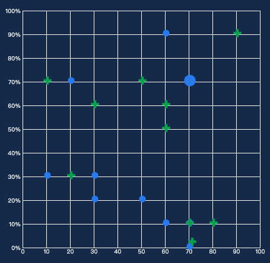
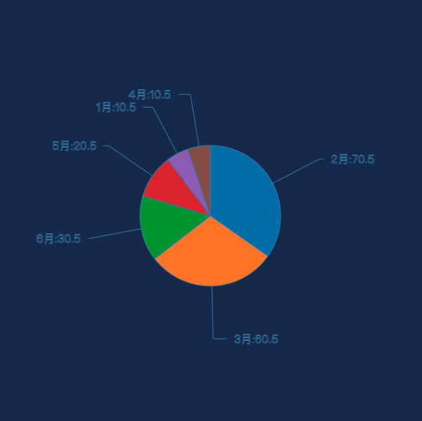
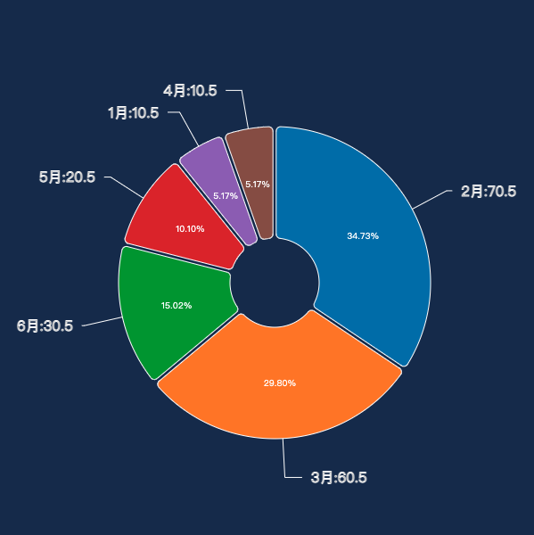
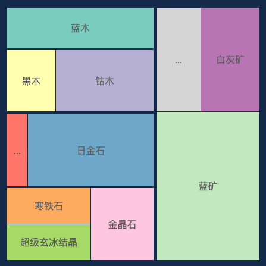
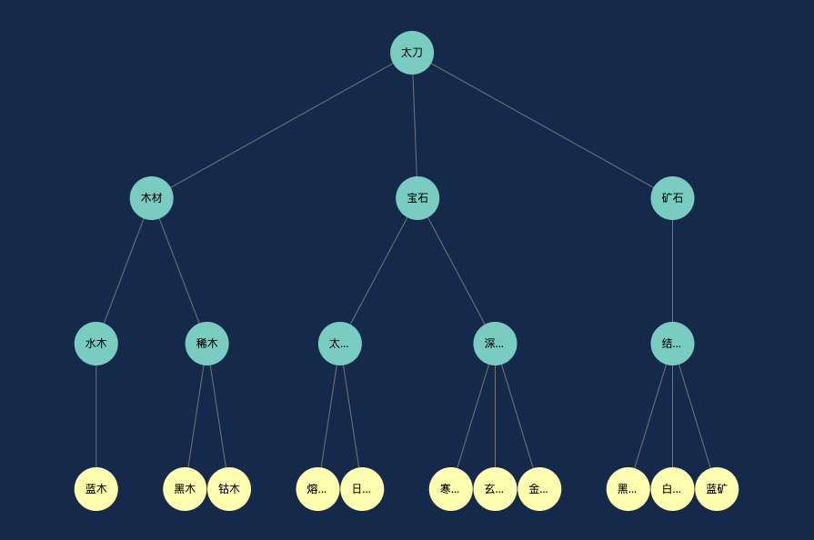

## D3-demo

[01. 基础柱状图](./\01.基础柱状图.html)

[02. 多列柱状图](./\02.多列柱状图.html)

[03. 堆叠柱状图](./\03.堆叠柱状图.html)

[04. 基础折线图](./\04.基础折线图.html)

[05. 遮罩折线图](./\05.遮罩折线图.html)

[06. 基础散点图](./\06.基础散点图.html)

[07. 多标记散点图](./\07.多标记散点图.html)

[08. 基础饼图](./\08.基础饼图.html)

[09. 环状饼图](./\09.环状饼图.html)

[10. 南丁格尔饼图](./\10.南丁格尔饼图.html)

[11. 矩形树状图](./\11.矩形树状图.html)

[14. 树图](./\14.树图.html)

