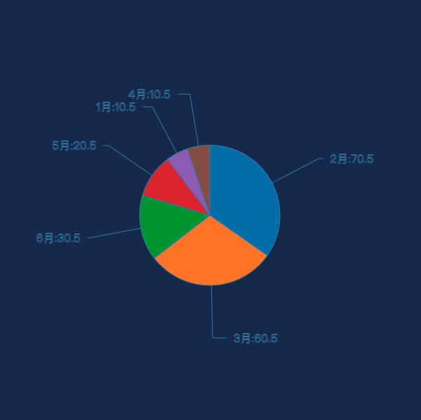
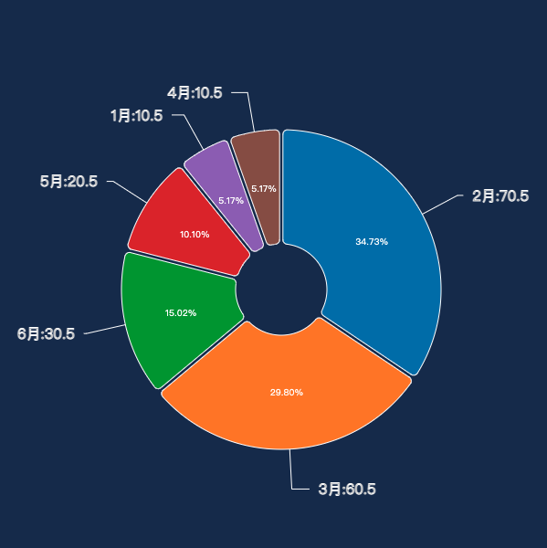

## D3-demo

[1. 基础柱状图](./\1.基础柱状图.html)

[2. 多列柱状图](./\2.多列柱状图.html)

[3. 堆叠柱状图](./\3.堆叠柱状图.html)

[4. 基础折线图](./\4.基础折线图.html)

[5. 遮罩折线图](./\5.遮罩折线图.html)

[6. 基础散点图](./\6.基础散点图.html)

[7. 多标记散点图](./\7.多标记散点图.html)

[8. 基础饼图](./\8.基础饼图.html)

[9. 环状饼图](./\9.环状饼图.html)

[14. 树图](./\14.树图.html)

